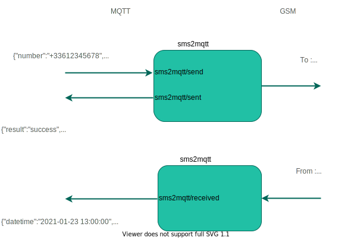

# Prerequisites

You need a GSM dongle "compatible" with Gammu : https://wammu.eu/phones/  
Even if your dongle is not listed, it should works with.

If you need specific gammu settings to be added, feel free to open a PR or an issue.

# How does it work



# How-to

## Install

Run by executing the following commmand:

```bash
docker run \
    -d \
    --name sms2mqtt \
    --restart=always \
    --device=/dev/ttyUSB0:/dev/mobile \
    -e PIN="1234" \
    -e HOST="192.168.1.x" \
    -e PORT=1883 \
    -e PREFIX="sms2mqtt" \
    -e CLIENTID="sms2mqttclid" \
    -e USER="usr" \
    -e PASSWORD="pass" \
    domochip/sms2mqtt
```

## Parameters explanation
* `--device=/dev/ttyUSB0:/dev/mobile`: Location of GSM dongle (replace /dev/ttyUSB0 with yours), it need to be mapped to /dev/mobile
* `-e PIN="1234"`: Optional, Pin code of your SIM
* `-e HOST="192.168.1.x"`: IP address or hostname of your MQTT broker
* `-e PORT=1883`: Optional, port of your MQTT broker
* `-e PREFIX="sms2mqtt"`: Optional, prefix used in topics for subscribe/publish
* `-e CLIENTID="sms2mqttclid"`: Optional, MQTT client id to use
* `-e USER="usr"`: Optional, MQTT user name
* `-e PASSWORD="pass"`: Optional, MQTT password

## Send

The default {prefix} for topics is sms2mqtt.  

To send SMS: 
* Publish this payload to topic *sms2mqtt/send* :  
`{"Number":"+33612345678", "Text":"This is a test message"}`  
* SMS is sent  
* A confirmation is send back through MQTT to topic *sms2mqtt/sent* :  
`{"Result":"Success", "DateTime":"2021-01-23 13:00:00", "Number":"+33612345678", "Text":"This is a test message"}`  

## Receive

Received SMS are published to topic *sms2mqtt/received* like this :  
`{"DateTime":"2021-01-23 13:30:00", "Number":"+31415926535", "Text":"Hi, Be the Pi with you"}`


# Updating
To update to the latest Docker image:
```bash
docker stop sms2mqtt
docker rm sms2mqtt
docker rmi domochip/sms2mqtt
# Now run the container again, Docker will automatically pull the latest image.
```
# Ref/Thanks

I want to thanks those repositories for their codes that inspired me :  
* https://github.com/pajikos/sms-gammu-gateway : I have a Huawei dongle and I found out that gammu 1.39 works fine with it :ok_hand:
* https://github.com/pkropf/mqtt2sms 
